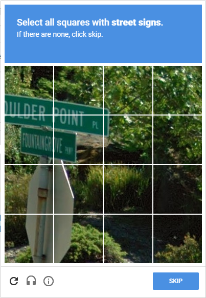

export { syntaxHighlighterPrism as theme } from "@mdx-deck/themes";

import { Notes, Image } from "mdx-deck";
import { Split } from "mdx-deck/layouts";
import BgImage from "./components/BgImage";

# Web Scraping With


Will Ockelmann-Wagner

wow@carbonfive.com | [github.com/will-wow](http://github.com/will-wow)

---

<BgImage src="assets/perfect-world.jpg">

# In a perfect world...

</BgImage>

---

# All data would be in JSON

<Notes>
  Anything you wanted to know would be avaialbe in an easy-to-parse format,
  ready for your programatic consumption.
</Notes>

---

<BgImage src="assets/real-world.jpg" opacity="0.5">

# In the real world...

</BgImage>

---

<Split>

# Sometimes all you have is a website


</Split>

<Notes>

And you have to make due
Sadly we don't be scraping space jam today.
It's a national treasure, but that markup is way too hard to parse, I tried, sorry.
But generally, HTML might not be JSON, but it's still pretty structured, and
you can often programatically get the data you want.
It turns out a functional langage like Elixir is a really nice HTML parser
And a concurrent langage like elixir is a really nice HTML fetcher
which is why we're talking about this in an Elixir meetup

</Notes>

---

# Before we continue

<Notes>

One thing before we get into this

</Notes>

---

<Split>

# Please put away any black hats


</Split>

<Notes>

Web scraping is one of those things that really useful, but often can be a little shady.
Don't scrape data you're not authorized to access, and don't accidentally
DDOS any sites

</Notes>

---

<Split>

# Basically don't make me do more of these



</Split>

<Notes>

Basically dont' make me do more of these
Does the little sliver of sign count? No one knows.

</Notes>

---

# Floki: HTML Parser

<Notes>

Okay with that out of the way
So what is Floki? It is an HTML parser.
It takes some HTML, could be from a site or a file or whatever
Parses it into data structure
Finds elements, gets attributes, updates the structure
But is all just acting on HTML, not an actual web page

</Notes>

---

# Not Floki: Headless Browser

## Try Wallaby or Hound instead

<Notes>

That means that if what you want to do is fill out forms and click buttons
and stuff, you'll want something like Wallaby or Hound,
which run in a real browser.

The sweet spot for Floki is when you're gathering data, and gathering links that you can follow to get more data.

If you need to update something, you can always make a form POST with HTTPoison.

</Notes>

---

# Floki Data Structure

```elixir
Floki.parse(~s(
  <div id="main"><strong className="bold">Hello</strong> World</div>
))

{"div", [{"id", "main"}],
 [{"strong", [{"classname", "bold"}], ["Hello"]}, " World"]}
```

---

# Floki Querying and Parsing

```elixir
[friend_path | _] =
  html
  |> Floki.find(".friend")
  |> List.first()
  |> Floki.find("a.profile-link")
  |> Floki.attribute("href")
```

<Notes>

Pipelines

</Notes>

---

<Split>

# Example Project: Actor Best Friends


</Split>

---

# ExMDB

- Scrape IMDB
- Find an actor
- Find some movies they've been in
- Find who else has been in those movies
- Count up the co-stars
- ???
- Profit