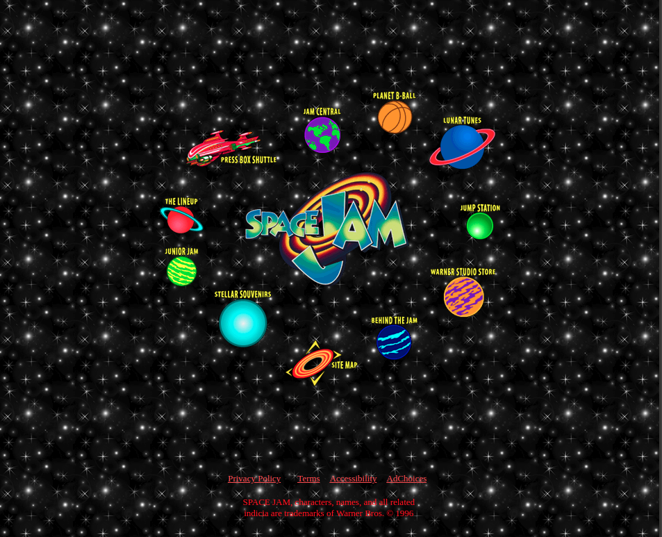

export { syntaxHighlighterPrism as theme } from "@mdx-deck/themes";

import { Notes, Image } from "mdx-deck";
import { Split, FullScreenCode } from "mdx-deck/layouts";
import BgImage from "./components/BgImage";
import BestFriendFinder from "./components/BestFriendFinder";

# Web Scraping With


Will Ockelmann-Wagner

wow@carbonfive.com | [github.com/will-wow](http://github.com/will-wow)

---

<BgImage src="assets/perfect-world.jpg">

# In a perfect world...

</BgImage>

---

# All data would be in JSON

<Notes>
  Anything you wanted to know would be avaialbe in an easy-to-parse format,
  ready for your programatic consumption.
</Notes>

---

<BgImage src="assets/real-world.jpg" opacity="0.5">

# In the real world...

</BgImage>

---

<Split>

# Sometimes all you have is a website



</Split>

<Notes>

And you have to make due
Sadly we don't be scraping space jam today.
It's a national treasure, but that markup is way too hard to parse, I tried, sorry.
But generally, HTML might not be JSON, but it's still pretty structured, and
you can often programatically get the data you want.
It turns out a functional langage like Elixir is a really nice HTML parser
And a concurrent langage like elixir is a really nice HTML fetcher
which is why we're talking about this in an Elixir meetup

</Notes>

---

# Before we continue

<Notes>

One thing before we get into this

</Notes>

---

<Split>

# Please put away any black hats


</Split>

<Notes>

Web scraping is one of those things that really useful, but often can be a little shady.
Don't scrape data you're not authorized to access, and don't accidentally
DDOS any sites

</Notes>

---

<Split>

# Basically don't make me do more of these


</Split>

<Notes>

Basically dont' make me do more of these
Does the little sliver of sign count? No one knows.

</Notes>

---

# Floki: HTML Parser

<Notes>

Okay with that out of the way
So what is Floki? It is an HTML parser.
It takes some HTML, could be from a site or a file or whatever
Parses it into data structure
Finds elements, gets attributes, updates the structure
But is all just acting on HTML, not an actual web page

</Notes>

---

# Not Floki: Headless Browser

## Try Wallaby or Hound instead

<Notes>

That means that if what you want to do is fill out forms and click buttons
and stuff, you'll want something like Wallaby or Hound,
which run in a real browser.

The sweet spot for Floki is when you're gathering data, and gathering links that you can follow to get more data.

If you need to update something, you can always make a form POST with HTTPoison.

</Notes>

---

# Floki Data Structure

```elixir
Floki.parse(~s(
  <div id="main"><strong className="bold">Hello</strong> World</div>
))

{"div", [{"id", "main"}],
 [{"strong", [{"classname", "bold"}], ["Hello"]}, " World"]}
```

---

# Floki Querying and Parsing

```elixir
[friend_path | _] =
  html
  |> Floki.find(".friend")
  |> List.first()
  |> Floki.find("a.profile-link")
  |> Floki.attribute("href")
```

<Notes>

Pipelines

</Notes>

---

<Split>

<div>

# Example Scraping Target: IMDB

</div>


</Split>

<Notes>

So today we're going to be scraping some data from IMDB
IMDB, suprisingly, doesn't have a public API
So if you want to look up Nic Cage's best movies, well it's National Treasure, but
You can hit up OMDB - the Open Movie Database, which gets its data from... scraping IMDB with a spider

</Notes>

---

<Split>

<div>

# ExMDB

## Finding Actor Best Friends

</div>


</Split>

<Notes>

We're going to do something similar
ExMDB, the Elixir Movie Database
Specifically going to try to answer a question about finding an actor's best friend
Which is to say, in their recent movies, who have they costarred with most frequently.
Mildly interesting question.

</Notes>

---

# ExMDB

- Scrape IMDB
- Find an actor by name
- Find some movies they've been in
- Find who else has been in those movies
- Count up the co-stars
- ???
- Profit

---

# Here's that in code

```elixir
def find_best_friends(name, movie_count) do
  name
  |> Scraper.fetch_actor_path()
  |> Scraper.fetch_actor_movies(movie_count)
  |> Enum.flat_map(&Scraper.fetch_movie_actor_names/1)
  |> aggregate_friends(name)
end
```

<Notes>

Here's how that looks in code. Because Elixir, it's pretty much the same as it is in english

</Notes>

---

# Fetching and parsing

```elixir
def fetch_actor_path(actor_name) do
  "/find"
  |> fetch_page(q: actor_name, exact: true, s: "nm")
  |> Parser.find_actor_path()
end

def fetch_page(path, params \\ []) do
  "https://www.imdb.com#{path}"
  |> HTTPoison.get!([], params: params)
  |> Map.get(:body)
end
```

<Notes>

Use not floki but something else like HTTPoison to fetch the page

This is the pattern these scraper functions will genererally follow:

- use HTTPoison to GET a webpage
- get the body (just an HTML string)
- pass the body to a function that does Floki Parsing

</Notes>

---

# Why Seperate Parsers?

- Seperation of concerns
- Fetch once, parse twice
- Testing

---

# Seperate Parsers: Testing

```elixir
test "find_movie_actor_names" do
  html = File.read!("test/exmdb/movie.html")

  assert Parser.find_movie_actor_names(html) == ["Robert Downey Jr."]
end
```

<Notes>

Because parsers just operate on HTML strings and Floki data structures,
parsers are just pure functions, and pure functions are easy to test.

You can also test your fetcher logic, but then you have to deal with dependency injection,
or using Mox, or something like that. So splitting up those two things makes sense.

</Notes>

---

<Split>

# An Artist Page


</Split>

<Notes>
  
So here's what the filmography section of an actor's page looks like
Each row in this table is a movie they're in, and the second cell has a link to the movie
page
which is what I want so I can see who was in that movie.
But, the ones with red text are still in production and often don't have the whole cast listed.
So I'd like to filter those out.

</Notes>

---

<Split>

# Pro-Tip: Disable JavaScript


</Split>

<Notes>

Floki doesn't run js, because its not a headless browser
It just takes exactly what the html route returned, and parses it
So if you turn off js, you'll see exactly what Floki will see
For IMDB it's about the same except dropdowns don't work
For Google though, the classes are totally different and not human-readable,
which makes it very hard to scrape. I wonder if that's on purpose.

</Notes>

---

# Parsing Movie Links (1)

```elixir
def find_actor_movies(actor_page, movie_count) do
  actor_page
  |> Floki.find(".filmo-category-section .filmo-row")
  |> Enum.filter(fn row ->
    # Filter out movies that may not
    # have a full cast list.
    Floki.find(row, ".in_production") == []
  end)
```

<Notes>

How do we go about parsing
He're the first part
Find those movie rows, and filter out the ones that are in production

</Notes>

---

# Parsing Movie Links (2)

```elixir
  movie_rows
  |> Enum.take(movie_count)
  |> Enum.map(fn row ->
    row
    |> Floki.find("a")
    |> Floki.attribute("href")
    |> List.first()
  end)
end
```

<Notes>

- Then get just first few rows - I'm not trying to crawl all of IMDB here
- Finally for each row, get the first link in the row
- Gives us a list of links to follow to get the actors in all those movies

</Notes>

---

<BestFriendFinder />

<Notes>

Hopefully this works! I'm using mdx-deck for the first time, so we'll see.
Here we can put in a name, and a number of movies
For Chris Evans (Cap) we won't need a lot of movies, because he's been focused lately

When i hit submit it'll do the scraping and give us back most frequent co-stars.
It should take a few seconds.

</Notes>

---

# Checks out


<Notes>

As you might expect, Chris Evans and Robert Downy Jr. do a lot of movies together.

</Notes>

---

# Moar Data

## For Seth Rogan, the last 20 movies, any guesses?

---

# Seth Rogan

```elixir
[
  {"James Franco", 4},
  {"Zac Efron", 3},
  {"Billy Eichner", 2},
  {"Nathan Fielder", 2},
  {"David Cross", 2},
  {"Lucy Liu", 2},
  ...
]
```

<Notes>

James Franco, those guys do like making movies together.
But he hasn't working with him in a few movies, I had to scrape 20
pages to get interesting results.
That took a long time

</Notes>

---

# 26 seconds is a long time

```bash
time mix best_friends "Seth Rogen" 20
> 3.81s user 0.55s system 16% cpu 25.886 total
```

<Notes>

I wrote a little mix script to automate this, and used time to time it
On my laptop, pretty fast internet, almost 26 seconds
If you were gathering a bunch of data, that would get old fast.

</Notes>

---

# Syncronous Api Calls are Slow

```elixir
name
|> Scraper.fetch_actor_path()
|> Scraper.fetch_actor_movies(movie_count)
# Too slow
|> Enum.flat_map(&Scraper.fetch_movie_actor_names/1)
|> aggregate_friends(name)
```

<Notes>

The problem is right there - I'm getting a list of movie page urls,
and mapping over them - one at a time, no concurrency.

In another language this could be annoying. In Elixir, making requests
in parallel is what it's all about

</Notes>

---

# async_stream to the rescue

```elixir
name
|> Scraper.fetch_actor_path()
|> Scraper.fetch_actor_movies(movie_count)
# So fast
|> Task.async_stream(fn movie_path ->
  Scraper.fetch_movie_actor_names(movie_path)
end)
|> Enum.flat_map(fn {:ok, names} -> names end)
|> aggregate_friends(name)
```

<Notes>

I just changed this ever so slightly, using an async_stream to do every
request concurrently in its own process

Other than that, all the other logic stays exacty the same

</Notes>

---

# Before

```bash
3.81s user 0.55s system 16% cpu 25.886 total
```

# After

```bash
4.50s user 0.69s system 62% cpu 8.348 total
```

<Notes>

Just that one change, over 20 requests, gets me a 3x improvement.
If you were doing enough requests, like crawling all of IMDB, you'd
need to do some work to make sure you're only making so many requests
and a time, and recover your place if it crashed, but Erlang still
makes all that very doable.

</Notes>

---

# What did we learn

- Floki parsing is easy to follow, easy to test
- Elixir makes parallel scraping easy
- Try disabling JS in your browser during development
- Be nice to the websites you're scraping
- Seth Rogen ❤️ James Franco

---

# Thanks!

Deck: [floki-talk.surge.sh](https://floki-talk.surge.sh)

ExMDB: [github.com/will-wow/exmdb](https://github.com/will-wow/exmdb)